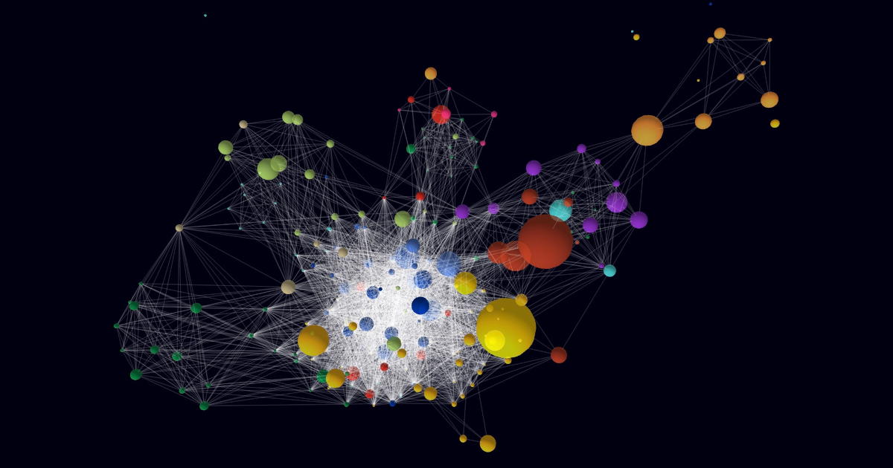

# RTA Network

> Visualization of regional trade agreement (RTA) network.

Each node is a country, whose size is set according to its nominal GDP (data mostly from the [World Bank](https://data.worldbank.org/indicator/NY.GDP.MKTP.CD)) and whose color is set according to its UNSD's [region/subregion](https://unstats.un.org/unsd/methodology/m49/overview).

A link between two nodes indicates that there is at least one active [regional trade agreement](https://rtais.wto.org/UI/PublicMaintainRTAHome.aspx) between those two countries. Partical scope agreements (PSAs) are excluded from the data.

## Upcoming

* Sorting countries by name, not by alpha-2 codes
* Use bloom for selected effects
* More customizable settings like particle color, link opacity, etc.
